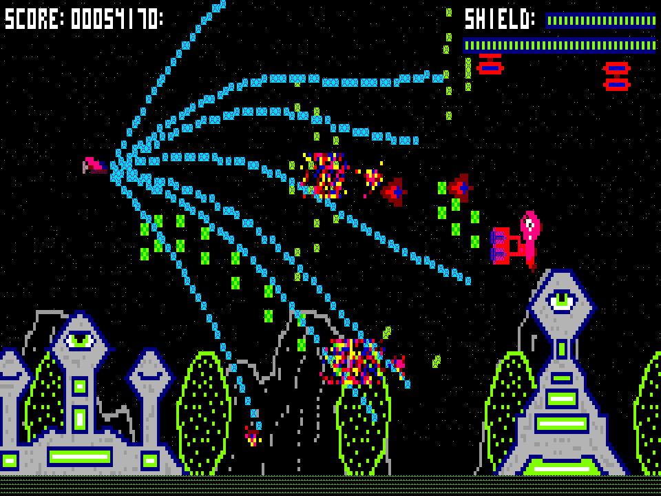

# The Descendant

This project is a port of a 2010 game I made at DigiPen with 3 other students in the GAM150 class. The original game only ran in windows' cmd.exe terminal window, and was written in pure C with a dependency on fmod for audio.
You can watch a video recording of it [here](https://www.youtube.com/watch?v=1tenTs2DOmQ).

This port is written in Common Lisp and uses SDL2 for audio, input, and a "slow" renderer, along with OpenGL for a "fast" renderer. The fast renderer is inspired by [refterm](https://github.com/cmuratori/refterm/).
You can press F9 while playing to see how fast the game can run on your machine with either renderer.

My desire to port the game grew around 2019 but I never got very far and it wasn't that important. In 2026 I decided to let Claude take a crack at it with claude code, and after not too much effort this is the result with Opus 5 on high effort.

Full disclosure: I've barely looked at the code or docs or tests. It feels somewhat dirty but at the same time it's pretty cool that the AI can do this relatively trivial thing (there's no ground-breaking math discoveries here) with limited guidance,
and it's been kind of fun to play this old game again. Other AI artifacts (claude.md, plan.md, git log, etc.) are available by request.

# Running

If running from source, you'll need to download [lgame](https://github.com/Jach/lgame) to a place that quicklisp can see (like `~/quicklisp/local-projects/`) but then you should be able to run `sbcl --script run.lisp` to launch the game.

Binaries are also available on the [Releases](releases/) page. The linux binary should work on machines with a relatively modern glibc; debian 13 uses 2.41.
The windows binary should also work, but is less tested and I observed one freeze in a quick test that may or may not have been from trying to play it over a network share drive.

# License

The new src, test, doc, and tools folders are published under the UNLICENSE.

The assets/ folder is the exception, the files here are the originals and are technically copyright to DigiPen.

There is also a font in the assets/ folder, dosapp.fon, which is copyright to MS. It can also be obtained from https://github.com/taveevut/Windows-10-Fonts-Default if it ever goes away.
